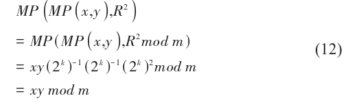
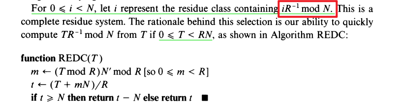
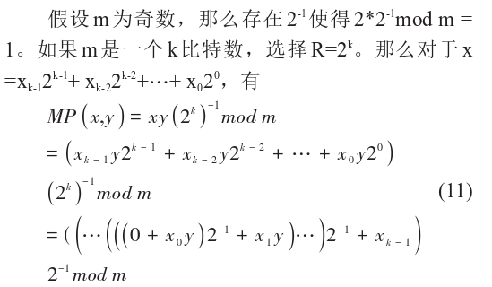
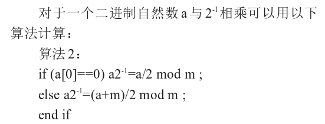
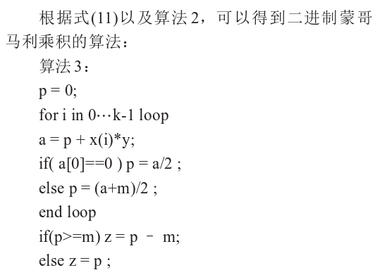
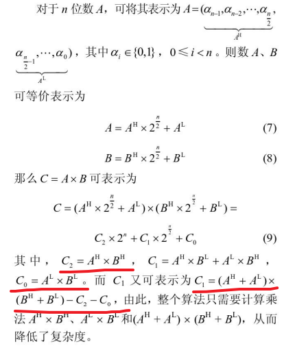
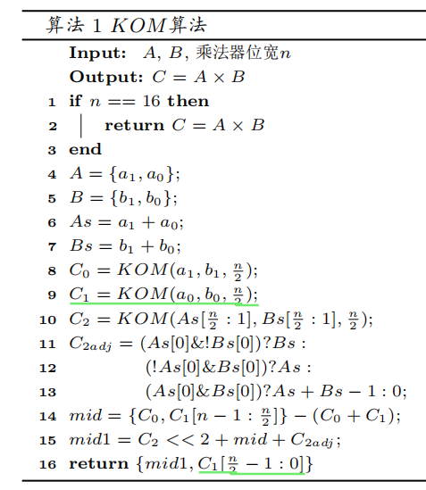
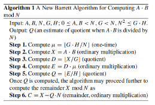
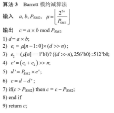

ECC优化 学习笔记

# 一. 域运算优化
## 1.1 数据结构

### 1.1.1 256比特的大整数

1. 使用数组表示一个大整数，即256比特的数可以表示为`uint64_t n[4]`，也可以表示为`uint32_t n[8]`

   1. 通常使用小端方式存储：低位放在低地址，高位放在高地址

2. 存储方式

   ```c
   // secp256k1中的表示形式
   typedef struct {
       uint64_t d[4];
   } secp256k1_scalar;
   ```

## 1.2 加/减法

相应分量带进位的加减操作

## 1.3 乘法

### 1.3.1 教科书方法

### 1.3.2 Karatsuba乘法

### 1.3.3 Montgomery乘法

>需要将结果从蒙哥马利域转到实数域，计算效率较低
>
>[蒙哥马利乘法原理的介绍](https://blog.csdn.net/BjarneCpp/article/details/77644958)
>
>针对Montgomery方法进行优化
>
>1. The SOS method
>2. The CIOS method

- 蒙哥马利模乘通过转换到另外一个域（蒙哥马利域）上进行计算，来避免模乘时需要进行模逆运算

  - 计算$x*y=z$的步骤，蒙哥马利算法通过以下步骤进行计算

    - 将标准域转换为蒙哥马利域，x转换为$x'=xR$，y转换为$y'=yR$，计算$x'=REDC((x\ mod\ N)(R^2\ mod\ N))$，$y'$的计算方法也一样
    - 使用REDC完成在蒙哥马利域上的乘法$z'=REDC(x'*y')=(x*y)R$
    - 将蒙哥马利域上的结果转换为标准域结果，使用的是REDC算法，即计算$z=REDC(z')=(x*y)$

  - 另外一种计算x*y的方式如下：

    

  - 加法和乘法不同，加法直接使用**普通的加法**进行运算即可。具体的加法运算规则如下：

    - 将标准域转换为蒙哥马利域，x转换为$x'=xR$，y转换为$y'=yR$，计算$x'=REDC((x\ mod\ N)(R^2\ mod\ N))$，$y'$的计算方法也一样
    - 使用普通加法完成在蒙哥马利域上的加法$z'=xR+yR=(x+y)R$
    - 将蒙哥马利域上的结果转换为标准域结果，使用的是REDC算法，即计算$z=REDC(z')=(x+y)$



### 1.3 二进制的蒙哥马利乘法

> 对硬件友好的计算方法

1. 计算$x*y*2^{-k}$通过变换，每次移动一位来完成计算
2. 对于每次移动一位，可以通过算法二完成计算



1. 除二的计算方法



1. 二进制蒙哥马利乘积的伪代码如下



### 1.3.4 RNS表示下的并行乘法

### 1.3.5 KOA算法

> KOA算法使用的是分治的方法
>
> KOA就是K






## 4. 模约减算法（规约 reduction）

> 其实就是取模运算，但是使用减法而不是除法来取模，所以也叫做约减

### 1.4.1 普通规约（classical）

### 1.4.2 Barrett规约





### 1.4.3 快速模约减算法

> 如果模数为梅森素数，可以快速对512比特的数进行求模
>
> 可以参考：基于软硬件协同的SM2椭圆曲线公钥密码算法加速_邓尧慷

在SM2中，点运算涉及的取模运算可以通过快速模约减算法实现

### 1.4.4 基于查表的模规约运算

A Fast Modular Reduction Method

## 5. 模乘运算

> 模乘结果可以直接由模乘算法得到，也可以**先进行乘法运算，再进行约减运算得到**

1. 模乘运算
   1. 蒙哥马利模乘
2. 先乘法，再求模
   1. **乘法：**
      1. KOA算法
   2. **求模：**
      1. 快速模约减算法
      2. Barrett算法

## 6. 求逆运算

### 6.1 扩展欧几里得

### 6.2 Montgomery

## 7. 平方根

### 7.1 shanks算法

### 7.2 Tonelli-shanks算法

# 二. 曲线运算优化

# 三. 协议层优化

## SM2

## SM9

# 四. 配对运算优化

# 五. 抗侧信道手段

# 六. 常见密码库的优化