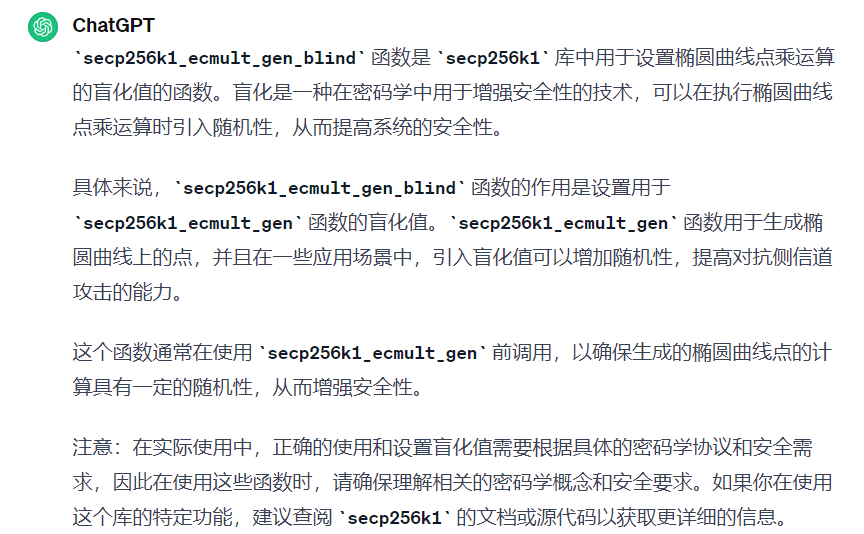
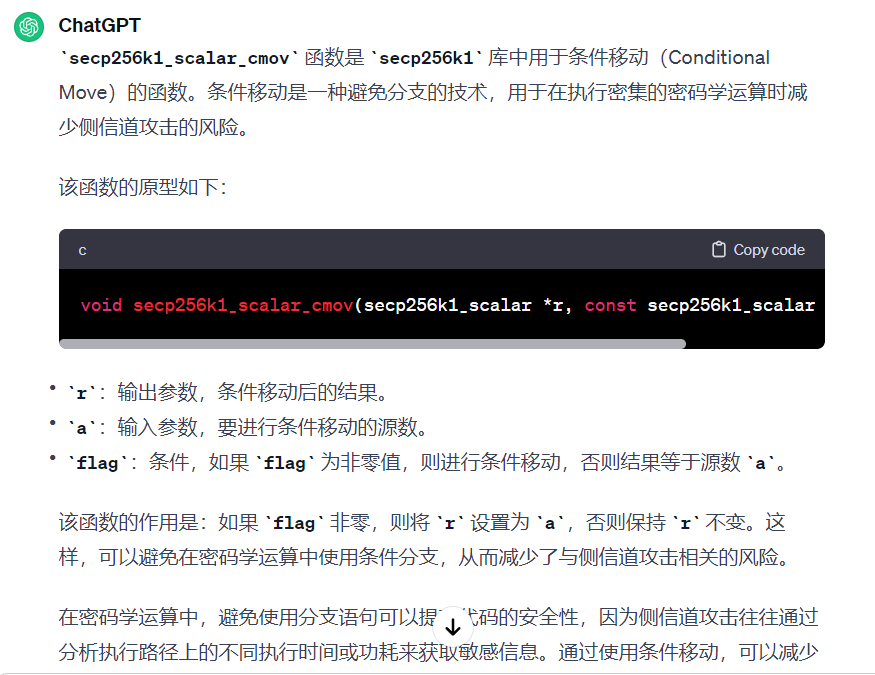

# 1. 签名函数调用过程

1. blinding values的作用：引入随机因子，提高安全性
2. 应该使用的是`4*64`的数据结构表示256 bits的数

```
secp256k1_context_create：给context分配空间

fill_random：生成随机字节流

secp256k1_context_randomize：
	secp256k1_ecmult_gen_context_is_built：判断是否为gen分配空间
	secp256k1_ecmult_gen_blind：
	
while (1)：生成私钥
	fill_random：生成随机字节流，存到uint8_t seckey[32]中作为私钥
	secp256k1_ec_seckey_verify：验证能否作为私钥，不能的话重新生成新的随机字节流作为私钥
	
secp256k1_ec_pubkey_create：根据私钥生成对应的公钥
	secp256k1_ecmult_gen_context_is_built：判断ecmult_gen的
	secp256k1_ec_pubkey_create_helper：生成公钥，结果保存在p中
		secp256k1_scalar_set_b32_seckey：将字节数组赋值给scalar变量
	secp256k1_pubkey_save：将p的值赋值给pubkey
	secp256k1_memczero：清空p在内存中的值
	secp256k1_scalar_clear：
	
secp256k1_ec_pubkey_serialize 公钥序列化成字节数组

secp256k1_sm2_precomputed 预计算(1+d)^-1、(1+d)^-1*d

secp256k1_sm2_sign
 secp256k1_sm2_sign_inner
 	noncefp：生成随机字节数组
 	secp256k1_scalar_set_b32_seckey：将随机字节数组放入nonce
 	secp256k1_declassify：清除敏感数据
 	secp256k1_sm2_sig_sign
 		secp256k1_ecmult_gen：针对基点G做倍点运算
 		secp256k1_ge_set_gej：将雅可比坐标转换为仿射坐标
 		secp256k1_fe_normalize：相当于模p
 		secp256k1_fe_get_b32：将有限域元素赋值为字节数组
 		secp256k1_scalar_set_b32：将字节数组赋值为scalar
 		secp256k1_scalar_add：scaler加法
```

# 2. 加密函数调用过程

```
secp256k1_context_create
secp256k1_context_randomize
生成私钥
	fill_random
	secp256k1_ec_seckey_verify
生成公钥
	secp256k1_ec_pubkey_create
secp256k1_sm2_encryption
	secp256k1_pubkey_load
	secp256k1_sm2_encrytion_inner
		生成nonce
		secp256k1_sm2_do_encrypt
			secp256k1_ecmult_gen：计算[k]G，返回的是gej，需要将gej转换为ge
			secp256k1_ecmult：输入a,b,P，计算[a]P+[b]G，返回的是gej，需要将gej转换为ge
```

# 3. 解密函数调用过程

```
secp256k1_sm2_decryption
	secp256k1_sm2_do_decrypt
```

# 4. 数据类型

1. secp256k1_scalar：表示256比特的整数
2. secp256k1_ge：表示椭圆曲线上的点（仿射坐标）
   1. secp256k1_gej：以射影坐标的形式

```c
// 用于表示椭圆曲线上的标量值
typedef struct {
    uint32_t d[8];
} secp256k1_scalar;

/** A group element of the secp256k1 curve, in affine coordinates. */
typedef struct {
    secp256k1_fe x;
    secp256k1_fe y;
    int infinity; /* whether this represents the point at infinity */
} secp256k1_ge;
```

# 5. 接口设计
1. client-start

   2. server-res
   3. client-finish

# 6. 基础知识

## blinding values



## cmov 条件移动

1. 如果flag非零，将r设置为a，否则r不变



# 7. 项目结构

## src

1. 函数声明和函数实现都是放在头文件中，区别在于**函数实现所在的头文件是以_impl结尾**
   1. 例如：**ecmult.h和ecmult_impl.h**、**ecmult_gen.h和ecmult_gen_impl.h**
2. ecmult：任意点的点乘运算
3. ecmult_gen：基点G的点乘运算

4. group：关于群元素的运算
5. field、filed_5x52：关于模p的域运算
6. scalar_4x64：关于模n的域运算

# 8. 曲线参数

## Secp256k1

```
p = FFFFFFFFFFFFFFFFFFFFFFFFFFFFFFFFFFFFFFFFFFFFFFFFFFFFFFFEFFFFFC2F   a=0000000000000000000000000000000000000000000000000000000000000000 b=0000000000000000000000000000000000000000000000000000000000000007
G=(79BE667EF9DCBBAC55A06295CE870B07029BFCDB2DCE28D959F2815B16F81798, 483ADA7726A3C4655DA4FBFC0E1108A8FD17B448A68554199C47D08FFB10D4B8)
n=FFFFFFFFFFFFFFFFFFFFFFFFFFFFFFFEBAAEDCE6AF48A03BBFD25E8CD0364141
h = 01
```

## SM2_P256（标准文档）

```
# SM2_P256
SM2_P256_p = 0x8542D69E4C044F18E8B92435BF6FF7DE457283915C45517D722EDB8B08F1DFC3
SM2_P256_n = 0x8542D69E4C044F18E8B92435BF6FF7DD297720630485628D5AE74EE7C32E79B7
SM2_P256_a = 0x787968B4FA32C3FD2417842E73BBFEFF2F3C848B6831D7E0EC65228B3937E498
SM2_P256_b = 0x63E4C6D3B23B0C849CF84241484BFE48F61D59A5B16BA06E6E12D1DA27C5249A
SM2_P256_Gx = 0x421DEBD61B62EAB6746434EBC3CC315E32220B3BADD50BDC4C4E6C147FEDD43D
SM2_P256_Gy = 0x0680512BCBB42C07D47349D2153B70C4E5D7FDFCBFA36EA1A85841B9E46E09A2
```

## SM2_P256（推荐曲线）

1. GmSSL中也是使用这条曲线

```
p=FFFFFFFEFFFFFFFFFFFFFFFFFFFFFFFFFFFFFFFF00000000FFFFFFFFFFFFFFFF
a=FFFFFFFEFFFFFFFFFFFFFFFFFFFFFFFFFFFFFFFF00000000FFFFFFFFFFFFFFFC
b=28E9FA9E9D9F5E344D5A9E4BCF6509A7F39789F515AB8F92DDBCBD414D940E93
n=FFFFFFFEFFFFFFFFFFFFFFFFFFFFFFFF7203DF6B21C6052B53BBF40939D54123
x=32C4AE2C1F1981195F9904466A39C9948FE30BBFF2660BE1715A4589334C74C7
y=BC3736A2F4F6779C59BDCEE36B692153D0A9877CC62A474002DF32E52139F0A0
```


# 9. 参数替换

## 曲线阶n

1. 参数所在位置：scalar_4x64_impl.h
2. 需要替换的内容：
   1. SECP256K1_N_0 ~ SECP256K1_N_3
   2. SECP256K1_N_C_0~ SECP256K1_N_C_3：表示2^256 - N
   3. SECP256K1_N_H_0 ~ SECP256K1_N_H_3：表示N的一半，通过N//2计算

```
/* Limbs of the secp256k1 order. */
#define SECP256K1_N_0 ((uint64_t)0x5AE74EE7C32E79B7ULL)
#define SECP256K1_N_1 ((uint64_t)0x297720630485628DULL)
#define SECP256K1_N_2 ((uint64_t)0xE8B92435BF6FF7DDULL)
#define SECP256K1_N_3 ((uint64_t)0x8542D69E4C044F18ULL)

/* Limbs of 2^256 minus the secp256k1 order. */
#define SECP256K1_N_C_0 ((uint64_t)0xA518B1183CD18649ULL)
#define SECP256K1_N_C_1 ((uint64_t)0xD688DF9CFB7A9D72ULL)
#define SECP256K1_N_C_2 ((uint64_t)0x1746DBCA40900822ULL)
#define SECP256K1_N_C_3 ((uint64_t)0x7ABD2961B3FBB0E7ULL)

/* Limbs of half the secp256k1 order. */
// 计算方法：n//2，不是n*2^-1
#define SECP256K1_N_H_0 ((uint64_t)0xAD73A773E1973CDBULL)
#define SECP256K1_N_H_1 ((uint64_t)0x94BB90318242B146ULL)
#define SECP256K1_N_H_2 ((uint64_t)0x745C921ADFB7FBEEULL)
#define SECP256K1_N_H_3 ((uint64_t)0x42A16B4F2602278CULL)
```

## 基点G和参数a、b

1. 参数所在位置：group_impl.h
2. 需要替换的内容
   1. SECP256K1_GE_CONST变量的值
   2. secp256k1_fe_const_b变量的值
   3. ==新增==：secp256k1_fe_const_a变量的值
   4. ==修改其中的点运算！！==

```
/** Generator for secp256k1, value 'g' defined in
 *  "Standards for Efficient Cryptography" (SEC2) 2.7.1.
 */
#define SECP256K1_G SECP256K1_GE_CONST(\
    0x79BE667EUL, 0xF9DCBBACUL, 0x55A06295UL, 0xCE870B07UL,\
    0x029BFCDBUL, 0x2DCE28D9UL, 0x59F2815BUL, 0x16F81798UL,\
    0x483ADA77UL, 0x26A3C465UL, 0x5DA4FBFCUL, 0x0E1108A8UL,\
    0xFD17B448UL, 0xA6855419UL, 0x9C47D08FUL, 0xFB10D4B8UL\
)

static const secp256k1_fe secp256k1_fe_const_b = SECP256K1_FE_CONST(0, 0, 0, 0, 0, 0, 0, 7);
```

# scalar运算/scalar_4x64_impl

> 这里指的scalar运算，指的是在模N下的运算

## 数据结构

1. 256比特的数表示方法：
2. 常量
   1. SECP256K1_N_0~3：表示模数N
   2. SECP256K1_N_C_0~3：表示2^256-N
   3. SECP256K1_N_H_0~3：表示N//2

```c
typedef struct {
    uint64_t d[4];
} secp256k1_scalar;

/* Limbs of the secp256k1 order. */
#define SECP256K1_N_0 ((uint64_t)0xBFD25E8CD0364141ULL)
#define SECP256K1_N_1 ((uint64_t)0xBAAEDCE6AF48A03BULL)
#define SECP256K1_N_2 ((uint64_t)0xFFFFFFFFFFFFFFFEULL)
#define SECP256K1_N_3 ((uint64_t)0xFFFFFFFFFFFFFFFFULL)

/* Limbs of 2^256 minus the secp256k1 order. */
#define SECP256K1_N_C_0 (~SECP256K1_N_0 + 1)
#define SECP256K1_N_C_1 (~SECP256K1_N_1)
#define SECP256K1_N_C_2 (1)

/* Limbs of half the secp256k1 order. */
// 计算方法：n//2，不是n*2^-1
#define SECP256K1_N_H_0 ((uint64_t)0xDFE92F46681B20A0ULL)
#define SECP256K1_N_H_1 ((uint64_t)0x5D576E7357A4501DULL)
#define SECP256K1_N_H_2 ((uint64_t)0xFFFFFFFFFFFFFFFFULL)
#define SECP256K1_N_H_3 ((uint64_t)0x7FFFFFFFFFFFFFFFULL)
```

## 接口定义

> 接口定义位于 ./src/scalar.h

1. secp256k1_scalar 开头的接口

```c
/** Clear a scalar to prevent the leak of sensitive data. */
static void secp256k1_scalar_clear(secp256k1_scalar *r);

/** Access bits from a scalar. All requested bits must belong to the same 32-bit limb. */
// 从offset开始，获取count比特值
// 获取的count比特值应该属于同一分量，即位于同一个32比特分量中
static unsigned int secp256k1_scalar_get_bits(const secp256k1_scalar *a, unsigned int offset, unsigned int count);

/** Access bits from a scalar. Not constant time. */
static unsigned int secp256k1_scalar_get_bits_var(const secp256k1_scalar *a, unsigned int offset, unsigned int count);

/** Set a scalar from a big endian byte array. The scalar will be reduced modulo group order `n`.
 * In:      bin:        pointer to a 32-byte array.
 * Out:     r:          scalar to be set.
 *          overflow:   non-zero if the scalar was bigger or equal to `n` before reduction, zero otherwise (can be NULL).
 */
static void secp256k1_scalar_set_b32(secp256k1_scalar *r, const unsigned char *bin, int *overflow);

/** Set a scalar from a big endian byte array and returns 1 if it is a valid
 *  seckey and 0 otherwise. */
static int secp256k1_scalar_set_b32_seckey(secp256k1_scalar *r, const unsigned char *bin);

/** Set a scalar to an unsigned integer. */
static void secp256k1_scalar_set_int(secp256k1_scalar *r, unsigned int v);

/** Convert a scalar to a byte array. */
static void secp256k1_scalar_get_b32(unsigned char *bin, const secp256k1_scalar* a);

/** Add two scalars together (modulo the group order). Returns whether it overflowed. */
static int secp256k1_scalar_add(secp256k1_scalar *r, const secp256k1_scalar *a, const secp256k1_scalar *b);

/** Conditionally add a power of two to a scalar. The result is not allowed to overflow. */
static void secp256k1_scalar_cadd_bit(secp256k1_scalar *r, unsigned int bit, int flag);

/** Multiply two scalars (modulo the group order). */
static void secp256k1_scalar_mul(secp256k1_scalar *r, const secp256k1_scalar *a, const secp256k1_scalar *b);

/** Shift a scalar right by some amount strictly between 0 and 16, returning
 *  the low bits that were shifted off */
static int secp256k1_scalar_shr_int(secp256k1_scalar *r, int n);

/** Compute the inverse of a scalar (modulo the group order). */
static void secp256k1_scalar_inverse(secp256k1_scalar *r, const secp256k1_scalar *a);

/** Compute the inverse of a scalar (modulo the group order), without constant-time guarantee. */
static void secp256k1_scalar_inverse_var(secp256k1_scalar *r, const secp256k1_scalar *a);

/** Compute the complement of a scalar (modulo the group order). */
static void secp256k1_scalar_negate(secp256k1_scalar *r, const secp256k1_scalar *a);

/** Check whether a scalar equals zero. */
static int secp256k1_scalar_is_zero(const secp256k1_scalar *a);

/** Check whether a scalar equals one. */
static int secp256k1_scalar_is_one(const secp256k1_scalar *a);

/** Check whether a scalar, considered as an nonnegative integer, is even. */
static int secp256k1_scalar_is_even(const secp256k1_scalar *a);

/** Check whether a scalar is higher than the group order divided by 2. */
static int secp256k1_scalar_is_high(const secp256k1_scalar *a);

/** Conditionally negate a number, in constant time.
 * Returns -1 if the number was negated, 1 otherwise */
static int secp256k1_scalar_cond_negate(secp256k1_scalar *a, int flag);

/** Compare two scalars. */
static int secp256k1_scalar_eq(const secp256k1_scalar *a, const secp256k1_scalar *b);

/** Find r1 and r2 such that r1+r2*2^128 = k. */
static void secp256k1_scalar_split_128(secp256k1_scalar *r1, secp256k1_scalar *r2, const secp256k1_scalar *k);
/** Find r1 and r2 such that r1+r2*lambda = k,
 * where r1 and r2 or their negations are maximum 128 bits long (see secp256k1_ge_mul_lambda). */
static void secp256k1_scalar_split_lambda(secp256k1_scalar *r1, secp256k1_scalar *r2, const secp256k1_scalar *k);

/** Multiply a and b (without taking the modulus!), divide by 2**shift, and round to the nearest integer. Shift must be at least 256. */
static void secp256k1_scalar_mul_shift_var(secp256k1_scalar *r, const secp256k1_scalar *a, const secp256k1_scalar *b, unsigned int shift);

/** If flag is true, set *r equal to *a; otherwise leave it. Constant-time.  Both *r and *a must be initialized.*/
static void secp256k1_scalar_cmov(secp256k1_scalar *r, const secp256k1_scalar *a, int flag);
```


## 加法

> secp256k1_scalar_add
>
> 带进位的加法，从低位开始加

## 负数/取反

> secp256k1_scalar_negate

计算 N-a，相当于 N + a的补码

## 乘法

> secp256k1_scalar_mul

1. 先进行乘法，再进行规约
   1. secp256k1_scalar_mul_512：使用的是教科书式的乘法

```c
static void secp256k1_scalar_mul(secp256k1_scalar *r, const secp256k1_scalar *a, const secp256k1_scalar *b) {
    uint64_t l[8];
    secp256k1_scalar_mul_512(l, a, b);
    secp256k1_scalar_reduce_512(r, l);
}
```

### secp256k1_scalar_mul_512

`a0*b0`

`a0*b1 + a1*b0`

...

### multadd_fast

**c1||c0 += a*b** 

```c
/** Add a*b to the number defined by (c0,c1). c1 must never overflow. */
#define muladd_fast(a,b) { \
    uint64_t tl, th; \
    { \
        uint128_t t = (uint128_t)a * b; \
        th = t >> 64;         /* at most 0xFFFFFFFFFFFFFFFE */ \
        tl = t; \
    } \
    c0 += tl;                 /* overflow is handled on the next line */ \
    th += (c0 < tl);          /* at most 0xFFFFFFFFFFFFFFFF */ \
    c1 += th;                 /* never overflows by contract (verified in the next line) */ \
    VERIFY_CHECK(c1 >= th); \
}
```

### sumadd_fast

**c1||c0 += a**

```c
/** Add a to the number defined by (c0,c1). c1 must never overflow, c2 must be zero. */
#define sumadd_fast(a) { \
    c0 += (a);                 /* overflow is handled on the next line */ \
    c1 += (c0 < (a));          /* never overflows by contract (verified the next line) */ \
    VERIFY_CHECK((c1 != 0) | (c0 >= (a))); \
    VERIFY_CHECK(c2 == 0); \
}
```

## 减法

### reduce（减去N）

> 计算的是 r-overflow*N，overflow的值为0/1
>
> 这里通过加上2^256-N来实现r-N
>
> 举个例子：
>
> `2^3=8，N=5，2^3-N=3`
>
> 那么 a=7，a-N => a+3 => 2

## 取模

### secp256k1_scalar_reduce_512

1. 利用的是曲线secp256k1的特性

1. $L = l_1\times 2^{256}+l_0=l_1(2^{256}-N)+l_1N+l_0$
   1. 所以，$L\ \%\ N=(l_1(2^{256}-N)+l_0)\%\ N$
   2. 而 $l_1 (2^{256}-N)$ 的大小为 256 + 129 = 385比特
   3. 因此只需要做一次乘法和加法就能够将 512比特降到385比特
   4. 利用重复的方法，分为129比特的$l_1$和256比特的$l_0$
   5. 而 $l_1 (2^{256}-N)$ 的大小为 129 + 129 = 258比特
   6. 因此只需要做一次乘法和加法就能够将 385比特降到258比特
   7. 再通过同样的方式，将258比特降到256比特

```c
/* Limbs of 2^256 minus the secp256k1 order. */
#define SECP256K1_N_C_0 (~SECP256K1_N_0 + 1)
#define SECP256K1_N_C_1 (~SECP256K1_N_1)
#define SECP256K1_N_C_2 (1)
#define SECP256K1_N_C_3 (0)
```

# 域运算 field_5x52_impl.h

> 依赖大数运算来完成

# tests_scalar.c

1. 编译命令：`gcc tests_scalar.c precomputed_ecmult.c precomputed_ecmult_gen.c -o tests_scalar -DHAVE_CONFIG_H`
   1. 其中利用到了预计算的表 **precomputed_ecmult**、**precomputed_ecmult_gen**
   2. **定义宏HAVE_CONFIG_H**来导入配置文件
2. 

# 更新日志

1. 2024.4.5
   1. 更换SM2_P256推荐曲线参数
   2. 修复check_overflow错误
   3. 新增reduce_512_barrett
   4. 测试scalar_mul和scalar_add通过
   5. 更新secp256k1_const_modinfo_scalar
      1. 求逆运算通过测试